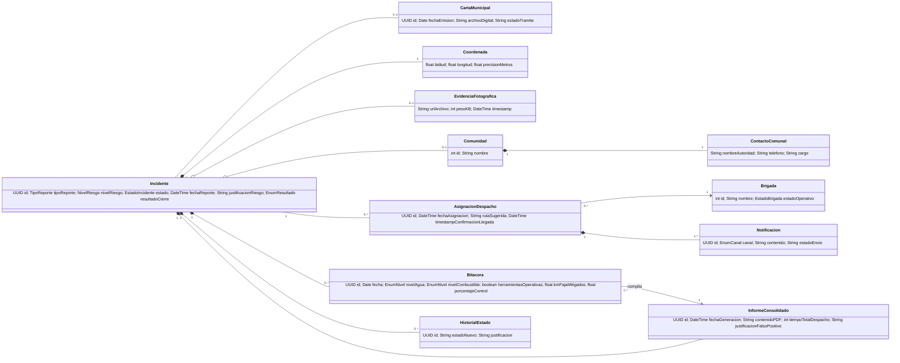

# Modelos UML 2.5 — Álbum del MVP

> Transcripción resumida de la **Actividad 3** (Álbum de Modelos UML, 22–23/09/2026). Las multiplicidades se
> transcribieron de las figuras 12–14; los tipos de datos no especificados y la clase `Usuario` son
> **inferencias** a validar en construcción (sección 5.2 del informe).

## 1. Módulos del sistema
| Módulo | Nombre | Responsabilidad | Paquete |
|---|---|---|---|
| M1 | Reporte Georreferenciado de Focos | GPS, reporte a distancia, foto, contacto comunal obligatorio; offline-first | `core.reporte` |
| M2 | Evaluación y Priorización de Riesgo | Motor de reglas Alto/Medio/Bajo (comunidades <5 km); reclasificación auditable | `core.triage` |
| M3 | Panel de Control de Emergencias (COED) | Kanban condicionado a la carta municipal; estados de cuadrillas | `core.despacho` |
| M4 | Asignación y Despacho de Brigadas | Brigada más cercana, notificación Push/SMS, reasignación "En Liquidación" | `core.despacho` / `core.operaciones` |
| M5 | Bitácora, Cierre y Auditoría (KPI) | Llegada, bitácora checklist, ΔT, informe consolidado inmutable | `core.operaciones` |
| MT-1 | Sincronización Offline-First (transversal) | Persistencia local y conciliación idempotente con el SGBD central (M1, M4, M5) | `core.sync` |
| MT-2 | Seguridad y Gobernanza Algorítmica (transversal) | Cifrado, control por rol, trazabilidad, explicabilidad (M1, M2, M5) | `core.seguridad` (en diagramas) |

Trayectoria transaccional: **M1 → M2 → M3 → M4 → M5**, con MT-1 y MT-2 operando de forma continua.

## 2. Casos de uso
Actores: Guardaparque/Comunario, Autoridad/Referente Comunal, Motor de Riesgo (sistema), Coordinador de Despacho,
Responsable UGR Municipal, Jefe de Brigada.

| Módulo | CU macro | Casos granulares |
|---|---|---|
| M1 | CU-01 Reportar foco de calor | CU-01 Capturar coordenadas GPS; CU-02 Reportar por avistamiento a distancia; CU-03 Registrar contacto comunal obligatorio («include» desde CU-01/02); CU-04 Enviar alerta por SMS («extend») |
| M2 | CU-02 Evaluar riesgo | CU-05 Calcular nivel de riesgo automático; CU-06 Reclasificar riesgo manualmente («extend») |
| M3 | CU-03 Gestionar panel | CU-07 Visualizar Kanban; CU-08 Filtrar por carta municipal formal («include», Ley 602); CU-09 Visualizar estados de brigada («include») |
| M4 | CU-04 Despachar brigada | CU-10 Sugerir brigada más cercana; CU-11 Asignar y despachar; CU-12 Notificar al jefe de brigada; CU-13 Reasignar brigada en liquidación |
| M5 | CU-05 Bitácora y cierre | CU-14 Confirmar llegada al punto GPS; CU-15 Registrar bitácora por checklist; CU-16 Calcular tiempo de despacho (KPI); CU-17 Generar informe consolidado |

Diccionario (resumen):
- **CU-01** Pre: GPS activo o reporte a distancia. Flujo: coordenada ≤15 m o hitos cardinales → foto ≤100 KB →
  contacto comunal → envío o almacenamiento local. FA-2: SMS ≤160 car. Post: foco **"Nuevo"** con contacto.
- **CU-02** Pre: foco "Nuevo" sincronizado. Distancia a comunidades (<5 km) en <5 s → Alto/Medio/Bajo →
  justificación. Extend: reclasificación con justificación en el historial.
- **CU-03** Pre: incidentes activos. Kanban + mapa semaforizado; filtro "Carta Municipal Formal"; estados de
  brigada. Post: focos con carta desbloqueados para el despacho legal.
- **CU-04** Pre: riesgo Alto/Medio **y** carta municipal registrada. Sugiere brigada → confirma en 1 clic →
  Push o SMS. Extend: reasignación de brigadas "En Liquidación" a <30 km. Post: brigada "En Desplazamiento",
  foco "Asignado" con cronómetro (timestamp inmutable).
- **CU-05** Pre: foco "Asignado". Llegada por GPS → checklist → tipificación del cierre → informe + ΔT vs. 180 min.
  FE-1: "Falso positivo" exige justificación. Post: incidente "Cerrado", informe inmutable.

## 3. Modelo de dominio — entidades y reglas
| Entidad | Regla de negocio |
|---|---|
| Incidente | Nuevo → Asignado → En atención → En Liquidación → Cerrado; despacho bloqueado sin CartaMunicipal |
| Coordenada | Precisión <15 m si es GPS nativo; sin motores cartográficos en línea |
| EvidenciaFotográfica | Comprimida ≤100 KB sin detener la alerta |
| Comunidad | Solo comunidades habitadas cuentan para el riesgo; estancias privadas excluidas |
| ContactoComunal | Obligatorio y bloqueante para el despacho |
| CartaMunicipal | Condiciona el despacho departamental; asociación **0..1** con Incidente |
| Brigada | Su estado operativo determina elegibilidad para asignación o reasignación |
| AsignaciónDespacho | Al confirmarse inicia el cronómetro inmutable del KPI |
| Notificación | Primero Web Push; sin cobertura, SMS |
| Bitácora | Solo checklist; inmutable una vez sincronizada |
| InformeConsolidado | 1 clic; inmutable; justificación si "Falso positivo" |
| HistorialEstado | Append-only: no se edita ni elimina |
| Usuario (inferencia) | Generaliza los 4 roles; el rol habilita acciones |

## 4. Diccionario de clases
| Clase | Paquete | Atributos | Métodos |
|---|---|---|---|
| Usuario (abstracta, inferencia) | seguridad (MT-2) | rol, telefono | autenticar(), recibirNotificacion() |
| Guardaparque | seguridad | hereda de Usuario | reportarFoco(c: Coordenada): Incidente |
| CoordinadorDespacho | seguridad | hereda de Usuario | reclasificarRiesgo(), asignarBrigada(i, b): AsignacionDespacho, generarInformeConsolidado(i) |
| JefeBrigada | seguridad | hereda de Usuario | confirmarLlegada(i), registrarBitacora(b) |
| ResponsableUGR | seguridad | hereda de Usuario | emitirCartaMunicipal(i): CartaMunicipal |
| Incidente | triage | id: UUID, tipoReporte: TipoReporte, nivelRiesgo: NivelRiesgo, estado: EstadoIncidente, fechaReporte: DateTime, justificacionRiesgo: String, resultadoCierre: EnumResultado | calcularRiesgo(), cambiarEstado(nuevo), calcularTiempoDespacho(): int |
| CartaMunicipal | triage | id: UUID, fechaEmision: Date, archivoDigital: String, estadoTramite: String | validar(): boolean |
| Coordenada | reporte | latitud: float, longitud: float, precisionMetros: float (≤15 m) | calcularDistancia(c): float |
| EvidenciaFotografica | reporte | urlArchivo: String, pesoKB: int (≤100), timestamp: DateTime | comprimir() |
| Comunidad | reporte | id: int, nombre: String, coordenadas: Coordenada | — |
| ContactoComunal | reporte | nombreAutoridad: String, telefono: String, cargo: String | validarNoVacio(): boolean |
| Brigada | despacho | id: int, nombre: String, estadoOperativo: EstadoBrigada (incluye EN_LIQUIDACION), ubicacionActual: Coordenada | calcularDistanciaA(c): float, actualizarEstado(e) |
| AsignacionDespacho | despacho | id: UUID, fechaAsignacion: DateTime, rutaSugerida: String, timestampConfirmacionLlegada: DateTime | notificarJefeBrigada() |
| Notificacion | despacho (MT-1) | id: UUID, canal: EnumCanal, contenido: String, estadoEnvio: String | enviar(): boolean |
| Bitacora | operaciones | id: UUID, fecha: Date, nivelAgua: EnumNivel, nivelCombustible: EnumNivel, herramientasOperativas: boolean, kmFajaMitigados: float, porcentajeControl: float | registrar() |
| InformeConsolidado | operaciones | id: UUID, fechaGeneracion: DateTime, contenidoPDF: String, tiempoTotalDespacho: int, justificacionFalsoPositivo: String | generar(), exportarPDF(): String |
| HistorialEstado | operaciones (MT-2) | id: UUID, estadoNuevo: String, justificacion: String (obligatoria) | registrarCambio() |

Enumeraciones:
- `NivelRiesgo`: Alto, Medio, Bajo.
- `EstadoIncidente`: Nuevo, Asignado, En atención, En Liquidación, Cerrado.
- `EstadoBrigada`: Disponible, En Desplazamiento, En Combate Activo, En Liquidación.
- `EnumResultado` (cierre): Controlado, Extendido, Falso positivo (según wireframe CU-05).
- `EnumNivel` (bitácora): agua Suficiente/Crítica; combustible OK/Reserva (según HU-5.2 y wireframe).
- `EnumCanal`: Web Push, SMS. `TipoReporte`: GPS cercano / avistamiento a distancia.

## 5. Relaciones
| Relación | Multiplicidad |
|---|---|
| Guardaparque —reporta→ Incidente | 1 — 0..* |
| ResponsableUGR —emite→ CartaMunicipal | 1 — 1 |
| Incidente — CartaMunicipal (Ley 602) | 1 — **0..1** |
| Incidente ◆ Coordenada (composición) | 1 — 1 |
| Incidente ◇ EvidenciaFotografica | 1 — 0..1 |
| Incidente ◇ Comunidad | 0..* — 0..1 |
| Comunidad ◆ ContactoComunal | 1 — 1 |
| CoordinadorDespacho —asigna→ AsignacionDespacho | 1 — 0..* |
| Incidente — AsignacionDespacho | 1 — 0..* |
| AsignacionDespacho → Brigada | 0..* — 1 |
| JefeBrigada —lidera→ Brigada | 1 — 1 |
| AsignacionDespacho ◆ Notificacion | 1 — 1..* |
| Incidente ◆ Bitacora | 1 — 0..* |
| Bitacora —compila→ InformeConsolidado | 1..* — 1 |
| Incidente ◆ InformeConsolidado | 1 — 0..1 |
| Incidente ◆ HistorialEstado | 1 — 0..* |

## 6. Trazabilidad requisito → clase
| Req. | Clases de soporte | Req. | Clases de soporte |
|---|---|---|---|
| RF-01 | Incidente, Coordenada | RF-13 | InformeConsolidado |
| RF-02 | Incidente, ContactoComunal | RF-14 | AsignacionDespacho, Incidente, InformeConsolidado |
| RF-03 | EvidenciaFotografica | RNF-01 | Incidente, Bitacora |
| RF-04 | Incidente, Comunidad | RNF-02 | Notificacion |
| RF-05 | Incidente | RNF-04 | Incidente |
| RF-06 | HistorialEstado, Incidente | RNF-05 | Incidente, Brigada |
| RF-07 | CartaMunicipal, Incidente | RNF-07 | HistorialEstado, InformeConsolidado |
| RF-08 | Brigada | RNF-08 | Coordenada, EvidenciaFotografica, ContactoComunal |
| RF-09 | Brigada, Coordenada | RNF-09 | (infraestructura) |
| RF-10 | AsignacionDespacho | RS-01 | Incidente, Coordenada |
| RF-11 | Notificacion | RS-02 | Incidente, Bitacora |
| RF-12 | Bitacora | RS-03 | HistorialEstado, Incidente |

## 7. Pantallas críticas (prototipos de baja fidelidad)
| CU | Pantalla | Plataforma |
|---|---|---|
| CU-01 | Reporte de foco (cerca / a distancia, GPS, foto, contacto autocompletado offline, aviso "se enviará por SMS") | Móvil |
| CU-01 | Reporte ultra-simplificado (una acción por pantalla, íconos) — RS-01 | Móvil |
| CU-02 | Evaluación y reclasificación (riesgo, distancia, justificación; mínimo 15 car.) | Web |
| CU-03 | Panel COED: columnas Nuevo / Asignado / En atención / En Liquidación, filtro "Con Carta Municipal", mapa con clustering | Web |
| CU-04 | Asignar brigada (lista por cercanía; "En Liquidación <30 km" sugerida para apoyo) | Web |
| CU-05 | Bitácora de turno (confirmar llegada, checklist, cierre Controlado/Extendido/Falso positivo) | Móvil |
